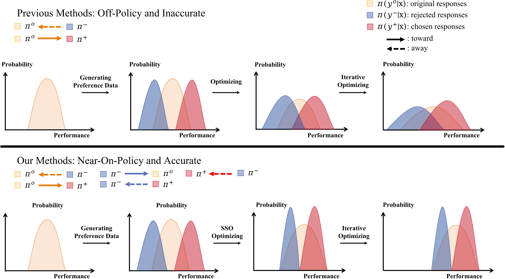

# Aligning Large Language Models via Self-Steering Optimization
Hao Xiang, Bowen Yu, Hongyu Lin, Keming Lu, Yaojie Lu, Xianpei Han, Le Sun, Jingren Zhou, Junyang Lin

----------

This research project introduces **Self-Steering Optimization (SSO)**, a novel algorithm that autonomously generates high-quality preference signals based on predefined principles during iterative training, eliminating the need for manual annotation. This repository includes code and data used in experiments with foundation models **Qwen2** and **Llama3.1**. All data and results are obtained and processed according to the respective data usage policies. 

*Please note that this repository may contain outputs from language models that are not fully safety-aligned, which may include content that is inappropriate or harmful.*

See the [paper](https://openreview.net/pdf?id=1HQZ4QFWi8) for more details.

----------


<p align="center">
    
</p>
<br>

<p align="center">
    
</p>

*Figure: Results of SSO in Online, Offline, and RM Training on Llama3.1-8B. Detailed results are presented in Section \ref{expmain} of the paper. In these figures, **SFT** indicates Llama3.1-8B-SFT, which we trained from Llama3.1-8B. **Instruct** indicates Llama3.1-8B-Instruct. **Skywork** is the dataset leading to the SOTA reward model for RewardBench.*

## What is Self-Steering Optimization (SSO)

Aligning large language models (LLMs) with human preferences is a challenging task that traditionally relies on substantial amounts of high-quality annotated preference data and reward models to guide the optimization process. This approach is resource-intensive and requires meticulous human attention. To address these limitations and advance automated alignment, we introduce **Self-Steering Optimization (SSO)**, a pioneering method that continuously generates automated, accurate, and learnable preference signals for the policy model.

**Key Philosophies of SSO:**

- **On-Policy Preference Signals:** The chosen and rejected responses, along with their associated signals, should primarily be on-policy—directly extracted from the policy model to suit its learning capacity.
- **Maintaining Signal Accuracy:** The accuracy of the synthetic signals should progressively increase or at least maintain a high level as the model undergoes training.
- **Consistent Gap Between Responses:** There should be a consistent gap between the chosen and rejected responses to ensure clear preference signals.

**Implementation:**

SSO prompts the policy model with the original query and a set of contrastive principles for responses. It then optimizes the model based on three key objectives:

1. **Steering Towards Chosen Responses:** Guide the model towards generating chosen responses by prompting with queries and positive principles.
2. **Ensuring On-Policy Responses:** Keep responses approximately on-policy, allowing the model to sample them even without additional principles.
3. **Maintaining Consistent Gap:** Ensure a consistent performance gap between the chosen and rejected responses.

As the policy model strengthens, it becomes increasingly adept at generating accurate and near-on-policy response pairs based on different principles, enabling further optimization of the model.

<p align="center">
    
</p>

*Figure: The philosophical motivation of our methods. Greater overlap on the x-axis (performance) between the generated distributions (red and blue) and the original distribution (orange) indicates stronger on-policy behavior. Previous automated methods extract chosen and rejected distributions through different methods, which may be less learnable for the policy model and hard to distinguish after iterative training. Our approach (SSO) optimizes models to generate near-on-policy signals where there remains a gap between chosen and rejected distributions, which benefits the automated alignment process.*

## (To be completed, before 11/20)
We will provide other details, such as installation instructions, usage, and more in the near future. Including:
- **Code**: Implementation of the Self-Steering Optimization algorithm.
- **Data**: Part of processed datasets used for training and evaluation.
- **Scripts**: Scripts for running experiments and evaluations.

## Citation

If you find this work useful, please cite our paper:

```bibtex
@inproceedings{
anonymous2024aligning,
title={Aligning Large Language Models via Self-Steering Optimization},
author={Anonymous},
booktitle={Submitted to The Thirteenth International Conference on Learning Representations},
year={2024},
url={https://openreview.net/forum?id=1HQZ4QFWi8},
note={under review}
}
```
